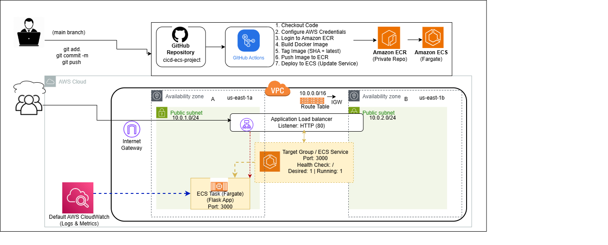

# CI/CD Pipeline with GitHub Actions, Docker, Terraform, and AWS ECS

This project demonstrates an end-to-end CI/CD pipeline for deploying a containerized Flask application to AWS using GitHub Actions, Docker, Terraform, Amazon ECR, and Amazon ECS (Fargate).

The pipeline automatically builds, tags, pushes, and deploys application updates whenever code is pushed to the `main` branch.

---

## Project Overview

This project covers:

- Application development using Python Flask
- Containerization using Docker
- Infrastructure provisioning with Terraform
- Image storage with Amazon ECR
- Container orchestration with Amazon ECS (Fargate)
- CI/CD automation using GitHub Actions
- Traffic routing using Application Load Balancer

---

## Architecture



### High-Level Flow

```text
Developer → GitHub → GitHub Actions → Amazon ECR → Amazon ECS → Application Load Balancer → End Users
```

---

## Project Structure

```bash
cicd-ecs-project/
│
├── .github/
│   └── workflows/
│       └── deploy.yml
│
├── app/
│   ├── app.py
│   └── requirements.txt
│
├── architecture/
│   └── aws-ecs-cicd-architecture.png
│
├── documentation/
│   └── cicd-pipeline-project-documentation.pdf
│
├── infra/
│   ├── main.tf
│   ├── provider.tf
│   ├── variables.tf
│   └── outputs.tf
│
├── Dockerfile
├── .gitignore
└── README.md
```

---

## Tools and Services Used

- Python Flask
- Docker
- GitHub
- GitHub Actions
- Terraform
- Amazon ECR
- Amazon ECS (Fargate)
- Application Load Balancer
- AWS CloudWatch

---

## CI/CD Workflow

The GitHub Actions pipeline performs the following steps:

1. Checkout source code  
2. Configure AWS credentials  
3. Login to Amazon ECR  
4. Build Docker image  
5. Tag image using SHA + latest  
6. Push image to Amazon ECR  
7. Deploy updated image to Amazon ECS  

The workflow is triggered automatically on every push to the `main` branch.

---

## Infrastructure Provisioned

Terraform was used to provision the following AWS resources:

- VPC
- Public Subnet A
- Public Subnet B
- Internet Gateway
- Route Table
- Security Groups
- Application Load Balancer
- Target Group
- Amazon ECR Repository
- Amazon ECS Cluster
- Amazon ECS Service
- ECS Task Definition

---

## Deployment Verification

Deployment was verified through:

- Successful GitHub Actions pipeline run
- Docker image pushed to Amazon ECR
- ECS service deployment success
- Healthy target group checks
- Application accessible through Load Balancer DNS

Application response:

```text
Congratulations Thompson! Your CI/CD pipeline is running successfully on AWS ECS.
```

---

## Documentation

Detailed project documentation including setup steps, screenshots, troubleshooting, and deployment verification is available below:

📄 [View Project Documentation (PDF)](documentation/cicd-pipeline-project-documentation.pdf)

---

## Key Takeaways

This project strengthened practical experience in:

- Infrastructure as Code
- Containerization
- CI/CD automation
- AWS networking
- ECS deployment
- Infrastructure troubleshooting

---

## Author

**Thompson**  
DevOps / Cloud Engineer